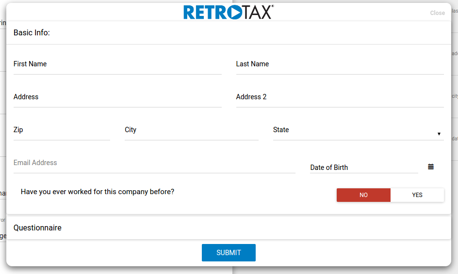
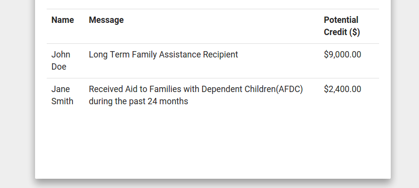

#Tax Credit Screening Plugin
Created by RetroTax


Introduction
============
The RetroTax Plugin is configurable, easy-to-use application built for our clients, alliance partners, and partering organizations to screen job seekers, applicants, and new hires for a range of tax credits. The plugin has 3 different modes for use with On-Boarding Systems, Applicant Tracking Systems, and Pre-Qualification Screening.



[Plugin Screenshot](https://drive.google.com/file/d/0B0LfxC9fk-YpLXU4S3Z5TXhfamc/view?usp=sharing)

----------------------------------------------------------------------------------------
Demo
============
Website Demo:
[https://www.retrotax-aci.com/plugin-demo/](https://www.retrotax-aci.com/plugin-demo/)

Configuration Demo:
[http://plugin.retrotax-aci.com/](http://plugin.retrotax-aci.com/)


----------------------------------------------------------------------------------------
Installation
============
1. Contact tech@retrotax-aci.com to request an API Key. For security, we will white-list your domain so only requests originating from that domain will be accepted.
2. Place `<script type="text/javascript" src="retrotax_plugin.js"></script>` either before the end of your `</head>` tag or at the end before your `</body>` tag (better)
3. Set your configuration values.
4. Whitelist the hostname of where you will install this script (see details below)
5. Verify Code
6. Start Screening


Reporting (ATS & PreQual)
============
Ultimately, the value of screening applicants for tax credits is the insight into whether hiring that applicant will likely result in a tax credit.  Reporting which applicants are pre-eligible can happen in one of two ways: 


1. via API Call - An API call made to view method (/api/v1/api_employees/view) will return the applicants eligibility status with a max_credit value.  This information can then be displayed on your HRIS dashboard.



2. via Email - These are scheduled on a daily, weekly, or monthly basis.  


Authorizing Your Hostname
============
The first attempt at using the plugin will result in an invalid hostname, which will kill the iframe after an alert is triggered.  This will continue until you authorize the hostname of where the plugin is installed.  To white-list a hostname, you must configure the plugin and attempt to run the plugin.  For each invalid attempt, an authorization code will be sent to the email address associated to your TCID account.  Please copy and past that code into the configuration settings.  With a valid code, the plugin will whitelist the hostname.  This must be done for all unique hostnames.


Sample Config (Minimum Requirements)
============

```javascript
var _retrotax_options = {
    iframe_base_path: 'widget/iframe',
    username:'demoapi.hiring.manager',
    apikey:'3AED82E2006D43BDGHHGD790BFF937FR',
    plugin_type:'ats'
}
```

----------------------------------------------------------------------------------------
Sample Config (Customized)
============

```javascript
var _retrotax_options = {
            iframe_base_path: 'widget/iframe',
            delay: 1000, 
            debug: true, 
            username:'demoapi.hiring.manager',
            apikey:'B47400F36FG8BA0C247698C94D153703',
            logo:'http://yoursite.com/path/to/your/logo/pic.png',
            companyid:1054
            locationid:8557,
            language_setting: 'en',
            hide_hm_section: 'false',
            readonly_fields: 'false',
            button_class:"btn btn-huge btn-info",
            button_text:"Open RetroTax Screening Plugin",
            button_class_error:"btn btn-huge btn-danger",
            button_text_error:"Aw, snap! Something broke",
            plugin_type: 'obs',  
            prepopulate_by:'id',
            populated_fields: {
                firstname:'first_name',
                lastname:'last_name',
                middleinitial:'middle_init',
                city:'city',
                state:'state',
                zip:'zipcode',
                address:'address',
                address2:'address2',
                dob:'dateOfBirth'
            },
            head_color: 'FFFFFF',
            panel_color: 'FFFFFF',
            text_color: '000000',
            error_color: 'c0392b',
            inputWidth: '50'

};
```

----------------------------------------------------------------------------------------
Tracking Incomplete ATS and OBS Applications
============
The plugin offers an optional method for tracking users that start the application but do not complete it.  Prior to closing the RetroTax plugin, if a user has not completed the form, the form's data (what has been filled in) is logged as an object, in addition to some other variables we track for error handling.  This feature requires some additional configuration so it's not available client-side in the plugin's settings; however, please reach out to us if this is a requirement for your set-up. Below, a sample incomplete form:
```javascript
(
    [form] => (
            [employeeid] => 0
            [username] => demoapi.hiring.manager
            [locationid] => ? boolean:false ?
            [firstname] => John
            [lastname] => 
            [address] => 3130 2nd St W
            [address2] => 
            [zip] => 
            [city] => 
            [stateid] => 10
            [dob] => 03/02/1987
            [recipient_name] => 
            [recipient_relationship] => 
            [recipient_cityreceived] => 
            [recipient_received_stateid] => 
            [recipient_received_county] => ? undefined:undefined ?
            [agency] => 
            [vocrehabinfo_phone] => 
            [dateconviction] => 
            [daterelease] => 
            [feloninfo_stateid] => ? object:null ?
            [servicestart] => 
            [unemployedstart] => 
            [unemployedstop] => 
            [compensatedstart] => 
            [compensatedstop] => 
        )

    [subject] => Incomplete
    [username] => demoapi.hiring.manager
    [user_agent] => Mozilla/5.0 (X11; Linux x86_64) AppleWebKit/537.36 (KHTML, like Gecko) Ubuntu Chromium/40.0.2214.111 Chrome/40.0.2214.111 Safari/537.36
    [window_size] => 845 x 993
    [screen_size] => 1865 x 1056
    [location] => http://localhost/plugin/widget/iframe/modal.html
)
```
----------------------------------------------------------------------------------------


Callback URL
============
The plugin provides a callback-url in which we will make a POST request with the TCID response after a user has completed and saved an ATS or OBS application.  The callback URL provided must be https; otherwise, the callback url will be ignored.  You can expect to receive a similar JSON structure as this:

```javascript
{
 "rows": [
  {
   "subdata": [
    [
     {
      "zone_message": "State-Specific Felon Credit",
      "zoneid": "FEL"
     },
     {
      "zone_message": "Lives in an Empowerment Zone",
      "zoneid": "FEZ"
     }
    ],
    [
     {
      "message": "Convicted of a felony or released from prison in the last 12 months",
      "max_credit": 2400,
      "targetgroup": "C"
     },
     {
      "message": "Designated Community Resident",
      "max_credit": 2400,
      "targetgroup": "D"
     }
    ]
   ],
   "maindata": {
    "veteran": 0,
    "dob": "January, 01 1991 00:00:00",
    "startingwage": 99.99,
    "scfib": 0,
    "foodstamps": 0,
    "doh": "August, 04 2014 00:00:00",
    "afdc": 0,
    "hashiringmanager": true,
    "zip": 78201,
    "ttw": 0,
    "unusablereasonid": "LT",
    "id": 485660,
    "qualifications": [
     "FEL - State-Specific Felon Credit",
     "FEZ - Lives in an Empowerment Zone",
     "[C] Convicted of a felony or released from prison in the last 12 months",
     "[D] Designated Community Resident"
    ],
    "documents": [
     {
      "has8850": false
     },
     {
      "has9061": false
     }
    ],
    "position": "",
    "lock": 1,
    "hiring_manager_completed": 1,
    "dgi": "August, 04 2014 00:00:00",
    "occupationid": 13,
    "formqualify": 1,
    "dsw": "August, 04 2014 00:00:00",
    "dojo": "August, 04 2014 00:00:00",
    "geoqualify": 1,
    "fullname": "John Doe",
    "deptva": 0,
    "rehire": 0,
    "legal_name": [
     "LangDev"
    ],
    "city": "San Antonio",
    "vocrehabagency": 0,
    "ruralrenewalcity": 0,
    "lastname": "Doe",
    "camisdemeanor": 0,
    "state": [
     "TX"
    ],
    "cawia": 0,
    "vocrehab": 0,
    "received_docs": [
     "IRS 8850 Form",
     "Signed Form A or Signed ATV"
    ],
    "firstname": "John",
    "tractid": 48029191002,
    "unemployed": 0,
    "felon": 1,
    "ssi": 0,
    "cafoster": 0,
    "address": "1654 N Calaveras",
    "location_name": [
     "Carmel Office"
    ],
    "cacalworks": 0,
    "ssn4": 6789,
    "autoqualify": 1,
    "userentered": 909,
    "cafarmer": 0,
    "cdib": 0,
    "applicationstatusid": "UN"
   }
  }
 ],
 "SUCCESS": true
}
```
----------------------------------------------------------------------------------------

Styling
============
The configuration settings allow for minor modifications in order to allow styling similar to your existing website/application.  In doing so, we aim to take RetroTax out of the equation for the end-user as much as possible. Within the configuration JSON, the following fields can be configured. If you require additional customization, we will gladly accommodate your custom CSS stylesheets, if your provide them. Please contact us if you'd like to discuss this further.

```
  logo: 'https://yourlogo.com',
  head_color: 'FFFFFF',
  panel_color: 'FFFFFF',
  text_color: '000000',
  error_color: 'c0392b',
  inputWidth: '50',

```

----------------------------------------------------------------------------------------
Compatability
============
The plugin script that is embeded in your website uses vanilla javascript and not dependent upon any framework (jQuery, etc, etc)

Currently, the plugin supports IE9+ and all modern browsers; however the plugin does not provide support for IE 7,8. If a user is viewing from IE8 the plugin is converted to a direct auto-login link, but only for the OnBoarding (obs) plugin_type.  So, rather than presented with an IFRAME, the user will be directed to our Tax Credit Screening platform (TCID) within a new browser.

----------------------------------------------------------------------------------------
Security
============
* Callback URL must be made over SSL


----------------------------------------------------------------------------------------
Mobile
============
Currently, the viewport must be set in the parent window (i.e. yours) in order for the plugin to be responsive on mobile devices.  To do this, ensure the following is set in the `<head>` of your document:

`<meta name="viewport" content="width=device-width, initial-scale=1">`


----------------------------------------------------------------------------------------
Configuration
============

Parameter | Req | Default | Options | Type | Description 
--- | --- | --- | --- | --- | ---
iframe_base_path | Yes | https://cdn.retrotax-aci.com/dist/widget/iframe | widget/iframe | String | The path to the iframe that gets injected over your page. This should not be changed unless you are testing locally. In that case, set it to 'widget/iframe'.
username | Yes | false | None | String | Your webscreen.retrotax-aci.com username
apikey | Yes | false | None | String - 32 Chars | Your webscreen.retrotax-aci.com client-side api-key, which can be found within TCID under 'Accounts'.
companyid | No | false | None | Int | If provided, the record created will be associated to that company ID. Furthermore, it will filter possible locations by the company ID (assuming multiple locations). If not provided, the user will be presented with a drop-down with a list of company entities. These companies and the drop-down were defined during your RetroTax OnBoarding process.
locationid  | No | false | None | Int | Similar to CompanyID, providing this will associate the record to this specific location and the location's parent company. If not provided, the user will be presented with a drop-down with a list of locations based upon their company selection.
callback_url | No | false | None | Valid URL String | Provide a callback URL and we will return a JSON response of each ATS or OBS submission
framework | No | bootstrap | None | String | Currently we only have one available front-end option. We aim to add Material Design and are open to designs that fit your company requirements
delay | No | 0 | None | Int | How long to delay before showing the plugin appears
debug | No | false | None | Boolean | If set to true, we will log to the console
prepopulate_by | No | false | 'id','name','string' | String | If set to id or name the plugin will auto-populate the values in those fields to match those to our field names.  
populated_fields | No | see below | see below | Obj | The object populated by the `prepopulate_by` parameter
hide_fields | NO | false | True, False | Boolean | Whether to hide prepopulated fields from the user or display their populated values. Boolean
plugin_type | Yes | 'demo' | 'ats','obs','demo'| String | The plugin's mode: Application Tracking System, OnBoarding System, or Demo
button_text | No | 'Open RetroTax Screening Plugin' | Any | String | What the text displayed to the end-user should say
button_text_error | No | 'Error - Something went wrong.' | Any | String | Optionally apply error text to the element's innerHTML in case of an error
button_class | No | '' | Any | String | Optionally apply a css class to the retrotax element 
button_class_error | No | '' | Any | String | Optionally apply a css class to the retrotax element in case of an error
logo | No | 'iframe/images/retrotax_plugin_logo.png' | String IMG SRC or False | String | Defaults to RetroTax Logo. Setting to false removes the RetroTax . Providing a valid URL will return that img src.
prequal | No | see below | see below | Obj | The pre-configuratable settings for plugin_type prequal
head_color | No | 'FFFFFF' | None | String | The HEX color for the modal's head
panel_color | No | 'FFFFFF' | None | String | The HEX color for the modal's panel
text_color | No | '000000' | None | String | The HEX color for the modal's text
error_color | No | 'c0392b'| None | String | The HEX color for the modal's error
inputWidth | No | 50 | see below | Int | The modal's input width
language_setting | NO |'en' | 'en', 'sp' | String | Plugin provide multi-langulage options
hide_hm_section | No| false | True, False | Boolean | Whether to hide hiring manager fields from the user or display
readonly_fields | No| false | True, False | Boolean | Whether to prepopulated fields are Editable fields or Readonly fields
```javascript

populated_fields={
        firstname:'', 
        lastname:'',
        middleinitial:'',
        city:'',
        state:'', //2 letter abbreviation or full state name; if match not found, rwe reject it and the user will be asked to provide it
        zip:'',
        address:'',
        address2:'',
        dob:'' // format must be mm/dd/yyyy; otherwise, we reject it and the user will be asked to provide it                   
    };
```

```javascript

prequal={
        email_to:'',  //single valid email
        email_cc:'',  //commma delimited email list
        partner_name:'',  //The contact at your company or organization which will be used as a reference in the generated prequal PDF letter 
        partner_organization:'', //Your company or organization
        partner_website:'', //valid URL
        closing_text:'', //closing sentence in the generated prequal PDF letter
        intro_text:'', //opening sentence in the generated prequal PDF letter
        logo_url:'', //valid URL
        logo_width:'', //integer
        logo_height:'', //integer 
        retrotax_contact:'' //name of RetroTax contact e.g. john.hess@retrotax-aci.com, natalie.commons@retrotax-aci.com, alan.newcomb@retrotax-aci.com             
    };
```
----------------------------------------------------------------------------------------


